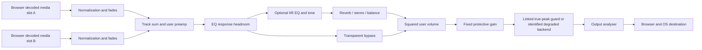
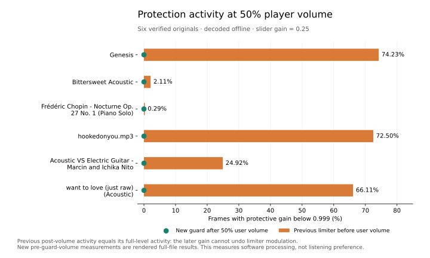

# Measured browser audio fidelity

The player retains HTMLMediaElement decoding, HTTP Range streaming, source
selection, media-session controls, saved presets and the existing UI. The
objective is preservation of decoded PCM and deliberate optional correction.
No browser claim of native DVC, DAC precision, USB bypass or Bluetooth codec is made.

## Active graph and migration

The late `AudioQuality` overrides in `player.js` install the active graph. The
older fixed 16-band chain and sample limiter class remain for baseline evidence;
they are disconnected from active audio. The only final output connection is
`analyser -> destination`. There is no gain boost after protection.

New installs start transparent, with normalization off. Existing `pa.settings`
without `audioMode` migrate to custom, retaining their effect values and
normalization choice. No preset is erased. Transparent mode bypasses EQ, tone,
reverb, stereo processing and deliberate crossfades, and sets playback rate to
1.0 without overwriting the saved settings. Leaving it restores them. Ordinary
pause/resume fades remain a transport feature. Editing a bypassed curve updates
its saved values; the EQ panel labels the bypass explicitly.

After successful MediaElementAudioSource routing, each element volume returns to unity; slot and master gains then own volume. This repairs the startup-muted spare element that previously made a preloaded switch silent. Actual output PCM, not only a running media clock, is verified.

The volume law is retained: gain = slider²; 50% is −12.0412 dB. It now precedes
protection. Fixed attenuation may make full-volume playback quieter, as shown in
Audio Info. It avoids unnecessary envelope modulation rather than recovering
information absent from the encoded source.

## Gain ledger

`gainLedger()` records normalization, preamp, EQ response attenuation, volume,
coherent overlap reserve and fixed protective gain. Analysis must match the exact
SHA-256 and size and declare measurements after decoder-applied container gain.
A complete album uses a shared album peak bound. Its member hashes must exactly
match the catalog group. A new member invalidates the complete-album claim.
Missing album evidence stays unnormalized; no silent per-track fallback occurs.

Measured track/R128 normalization has an optional −16 LUFS target. R128 gain is
signed Q7.8 relative to −23 LUFS and the already applied OpusHead gain:
`gain dB = tag / 256 + target + 23`. Thus −573 at −16 becomes +4.76171875 dB;
the header is not added in the graph. Valid decoded analysis takes precedence,
then the selected R128 tag, then the selected legacy ReplayGain tag. Legacy
ReplayGain retains its original ~89 dB convention and is not labeled LUFS.
Malformed, duplicate, nonfinite and out-of-range tags are ignored/rejected.

Unknown peak uses a documented +3 dBTP working assumption and a final guard.
At unity volume and flat processing, this reserves −6 dB with the guard's
2 dB detector margin. It is not a proof about every unknown file. Lower volume
can supply the headroom already; attenuation is not duplicated. EQ headroom
adaptively refines response maxima after a 2048-point scan. This is a
steady-state estimate, not a transient bound. Reverb receives an additional
3 dB reserve. Coherent crossfade reserve is 6.0206 dB while two tracks overlap.
The implementation uses linear fades, not an allegedly peak-safe equal-power mix.

FFmpeg's summary true peaks are rounded to 0.1 dB. Tiny residual guard action
in some full-volume fixed-gain corpus cases is retained in the evidence, rather
than claimed to be absent. At 50% pre-guard volume, all six files had zero action.

## Guard and numerical limits

The original sample-only guard was compared with FFmpeg 7.1's `alimiter` and
libebur128 1.2.6's polyphase detector. Neither is simply renamed true peak.
The new original JS implementation uses a 4×, 128-tap-per-phase Blackman-windowed
sinc detector, compensated detector delay, linked stereo lookahead and a bounded
monotonic future-peak queue. Only the detector is oversampled. Output stays at
the context rate. Lookahead is 6 ms plus 64 samples; release is 80 ms. All buffers
are preallocated and `tick()` allocates nothing. Worklet output uses the actual
block length. Telemetry runs four times a second. Filter coefficient arithmetic
uses JS doubles; PCM stays floating point. No dither or forced high output rate.

The application-side ceiling is −1 dBTP with an explicit 2 dB detector/modulation
margin, so the detector threshold is −3 dB. BS.1770's 4× sinusoid under-read
can reach 0.688 dB before FIR and modulation errors. A separate SciPy 32×, 8193-tap Kaiser
oracle measures rendered OUTPUT, including edges, transients and release.
The acceptance threshold stays −0.9 dBTP. This establishes the tested digital
corpus, not arbitrary downstream resampling, DAC reconstruction or Bluetooth.

A disabled/inactive guard retains the same delay and exact float identity at
unity. Seeking, stopping and hard source switches reset delayed samples and
replace filter state. Natural advances retain the guard delay/tail so queued final samples are delivered; they are not hard discontinuities. A processor failure reconnects one degraded compressor
path, with extra fixed headroom. It is explicitly labeled true-peak unverified.
The native browser compressor is never presented as the validated guard. A 3-second telemetry heartbeat timeout also recovers rendering failure when Chromium omits the processorerror event; it is suspended while the context or playback is inactive. The controlled callback-exception fixture reproduced that event omission in Chromium 151 and verified continued decoded playback through the single fallback path. Its
absence/error paths keep playback running; worklet state is not reused across
contexts.

## EQ and headphone evidence

The existing parametric ARTTI T10 and AirPods Pro 2 AutoEq data is retained,
including its Fahryst/Filk/Harpo/Crinacle source labels and alternative fit/ANC
measurements. No new ear measurement or replacement coefficients were invented.
Preset application records its catalog provenance. These are population
measurements, not the owner's ears. The optional custom path retains editing,
import, bass/treble preferences and automatic headroom. Headphone correction
must be selected deliberately and should not be stacked with the same Android
or native-player correction.

Peak filters use linear Q. Shelves use `alpha=sin(w)/(2Q)`, not Q-as-slope:
`1/Q²=(A+1/A)*(1/S−1)+2`. Frequencies clamp at the actual processing rate.
Zero gain bypasses exactly. Jury pole checks reject unstable coefficients.
The existing browser EQ supports 20–20,000 Hz, ±15 dB and Q 0.1–12;
imported values outside those control ranges are clamped when a curve is applied.
Native backup settings outside supported browser processing are skipped.
Curve transitions use complementary 25 ms linear fades and apply attenuation
before a boost; concurrent curves can alter phase during edits, so the transition
is intentional processing, not labeled transparent. Reset discards prior tails.

## Reproduction and retained evidence

- `docs/audio-evidence/criteria.json`: criteria declared before DSP tuning.
- `corpus.json`: six authorized R2 objects, hashes, byte counts and object proofs.
- `corpus-measurements.json`: complete-file old/new processing and FFmpeg scans.
- `guard.json`: phase sweeps, impulses, bass modulation and near-Nyquist tests at
  44.1/48/96 kHz, independent 32× output oracle and idle null.
- `graph.json`: full production graph rendered in Chrome, gain/delay-aligned
  float identity and rendered IIR/reference comparisons.
- `opus-browser.json`: synthetic positive/negative OpusHead gains, seeks and
  44.1 kHz input through actual HTMLMediaElement + production graph.
- `eq-extremes.json`: 108 rendered impulse cases at exposed frequency/Q/gain extremes, phase checks and 24-second decay tails. This compares the rendered transfer to a separate complex evaluation of the supplied coefficients; `graph.json` separately checks the coefficient algebra.
- `transitions.json`: rapid peak/shelf/mode edits through the production graph, independently scanned at 32× with long-tail checks.
- `browser.json`: real R2 streaming, seek/resume, Range/CORS, artwork, media session, natural next, hard switch and controlled callback failure.
- `transport-latency.json`: cloud transport-clock startup/seek observations against the previous live source; network and polling included, audible latency unmeasured.
- `worker-release.json`: actual backend revision, Actions run, rollback version and locally verified checkpoint ZIP digest; unsigned corrections rejected.
- `endurance.json`: final 30-minute original-R2 run, real output RMS, clock progress and heap samples.
- Frontend release evidence is recorded in deployment status after live verification.

Run `npm test`; `python -m unittest discover -s tests -p 'test_r2*.py'`;
`python scripts/audio/verify-guard.py --output report.json` (NumPy/SciPy);
`node scripts/audio/graph.mjs`; generate fixtures with
`python scripts/audio/opus-fixtures.py --output /tmp/opus-fixtures`, then set
`AUDIO_FIXTURES=/tmp/opus-fixtures node scripts/audio/opus-browser.mjs`.
`AUDIO_ENDURANCE_MINUTES=30 AUDIO_REPORT=/tmp/endurance.json node scripts/audio/browser.mjs`
uses actual authorized R2 streams and intercepts only frontend source assets.
The browser executable defaults to `/usr/bin/chromium`; playback corpus bytes
are local temporary evidence and never enter the repository/frontend artifact.

Analysis is optional and bounded in `scripts/audio/analyze.py`, not in the Worker
or real-time callback. It reads decoded float PCM and FFmpeg `ebur128=peak=true`
without `loudnorm`, normalization or rewriting. `upload-music-r2.py --analyze`
preserves audio bytes; unavailable optional tools do not block uploading.
Analysis passes through signed registration, strict index validation and source
mapping. Existing duplicate registration retains its stable song. A separate
signed `/music/uploads/analysis` updates metadata only, binding the existing
hash/size/R2 identity and prior analysis revision, with conditional writes,
idempotency and conflict rejection. Unsigned public input cannot lower protection.

The deployment repository's manual `analyze-r2-audio.yml` performs at most 100
objects per invocation using existing Actions secrets only. `analyze` writes an
artifact and checkpoint, not R2. After reviewing it, `apply` downloads that exact
successful run artifact, verifies the source SHA, audio proofs and prior analysis,
then conditionally updates the catalog. Concurrent uploads are preserved. There
is no schedule, Google request, library mirroring or audio-object write. Repeat
only as an explicit one-time bounded backfill using the reported `lastId`.

## Acceptance evidence

| Criterion | Evidence and practical limit |
| --- | --- |
| Transparent graph | Six production-graph cases: exact float null at 44.1/48/96 kHz, unity and 50% volume; downstream hardware is unknown. |
| Gain metadata | Parser/schema/security fixtures and eight Chromium Opus gain/seek captures; header gain is applied once. |
| Loudness and peaks | Six hashed originals, FFmpeg 7.1.5 and separately built libebur128 1.2.6; official EBU vectors unavailable (403). |
| Protection | 297 stress cases pass the independent long 32× output oracle; worst −1.658 dBTP against −0.9. |
| EQ | Independent coefficient algebra, 108 rendered extreme cases and rapid production-graph edits; edit output peaks around −4.915 dBTP. |
| Full pipeline | Actual R2 decode/Range/CORS, artwork, media session, two-slot transitions, real callback failure and measured non-silent recovery. Drive/local/server regression tests remain separate; no Google audio was fetched. |
| Endurance | Final 30-minute run passed 180 actual-PCM samples, advancing clocks, alternating volume, seeks and mode edits, followed by non-silent recovery from a real callback exception. See `endurance.json`; cloud behavior does not certify the phone. |
| Regression/release | 249 source JavaScript / 93 Python / 530 deployment tests and the exact pinned build. Live pin and rollback evidence are recorded after promotion. |

## Small owner comparison protocol (hardware unverified)

1. Use Genesis with SHA-256
   `dada1575177136141027298e21b4b73d0e1cf9eace01ac3ea4ac98492f22f34e`
   on the same Samsung A15 SM-A156U, headphone and route. First use the USB DAC
   and ARTTI T10. Bluetooth with AirPods Pro 2 is a separate test; negotiated
   codec cannot be inferred from this player.
2. In Jarvis select Transparent, normalization Off, and record Audio Info.
   In native Poweramp use 1.0 speed and flat processing. Record its output plugin,
   DVC, limiter, normalization, preamp and crossfade choices. Record only the
   Samsung EQ/Adapt Sound/Dolby options actually available on this model/route.
3. Match measured output level, ideally within 0.1 dB using calibrated wired
   capture. Do not match slider percentages or raise hardware volume to maximum.
   Align the captured delay and compare short randomized excerpts with a hidden
   reference; keep a trial log. Repeat with deliberately matched headphone EQ.
4. Check screen-off/background playback, USB detach/reconnect, Bluetooth handoff,
   seeks and UI/network load on the phone. Record stalls/processor errors and
   capture levels. Cloud Chrome does not certify phone battery, route behavior,
   listening preference or hardware bit-perfect output.

## Primary basis

Web Audio 1.0: https://www.w3.org/TR/webaudio-1.0/
RFC 7845 §§5.1–5.2: https://www.rfc-editor.org/rfc/rfc7845.html
Chromium Opus decoder (OPUS_SET_GAIN):
https://chromium.googlesource.com/chromium/src/+/refs/heads/main/media/filters/opus_audio_decoder.cc
ITU BS.1770-5 Annex 2, finite oversampling error:
https://www.itu.int/rec/R-REC-BS.1770
RBJ cookbook: https://www.w3.org/TR/audio-eq-cookbook/
libebur128 1.2.6: https://github.com/jiixyj/libebur128/tree/v1.2.6
FFmpeg ebur128/alimiter: https://ffmpeg.org/ffmpeg-filters.html

The initial 48-tap detector failed the stronger long-filter reference near Nyquist (worst −0.375 dBTP). Increasing the detector to 128 input taps per phase addresses that measured failure; the −0.9 dBTP acceptance threshold was retained. Earlier short-oracle success is not the final evidence.

Independent libebur128 1.2.6 (`67b33abe1558160ed76ada1322329b0e9e058b02`)
was built separately and scanned the same decoded corpus. Integrated loudness
agrees with FFmpeg's rounded summaries within 0.054 LU; source true peaks within
0.051 dB. `scripts/audio/libebur128-reference.c` is the retained driver. Compile
it against that upstream release with `gcc -O2 ... ebur128.c -lm` and feed
interleaved float PCM, channels and rate. Official EBU public vector download
returned HTTP 403 in this environment: EBU-vector conformance was not verified.
The existing mature meters are not claimed to be new certified implementations.
